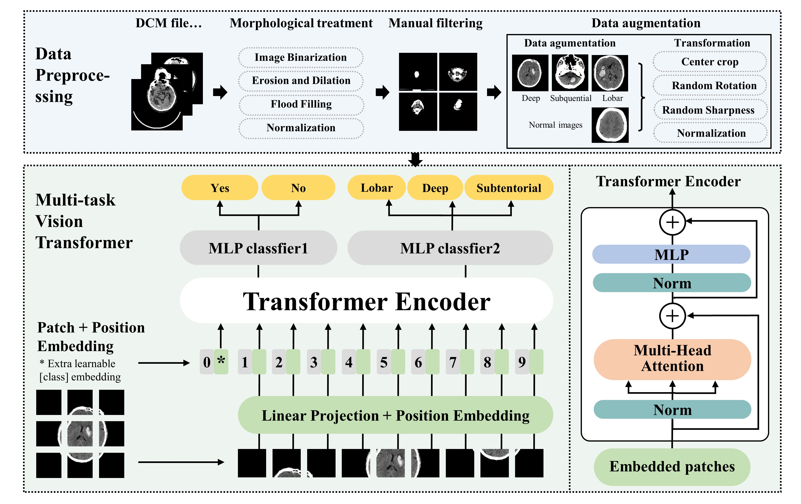

# DTViT

This repository contains the source code and data for the paper "Dual-Task Vision Transformer for Rapid and Accurate Intracerebral Hemorrhage CT Image Classification" published in  [arxiv_link](https://arxiv.org/abs/2405.06814).
If you use this code in your research, please cite the following paper:

```bib
@article{fan2024dual,
  title={Dual-Task Vision Transformer for Rapid and Accurate Intracerebral Hemorrhage CT Image Classification},
  author={Jialiang Fan, Xinhui Fan, Chengyan Song, Xiaofan Wang, Bingdong Feng, Lucan Li, Guoyu Lu},
  journal={arXiv preprint arXiv:2405.06814},
  year={2024}
}
```


## Abstract

Intracerebral hemorrhage (ICH) is a severe and sudden medical condition caused by the rupture of blood vessels in the brain, leading to permanent damage to brain tissue and often resulting in functional disabilities or death in patients. Diagnosis and analysis of ICH typically rely on brain CT imaging. Given the urgency of ICH conditions, early treatment is crucial, necessitating rapid analysis of CT images to formulate tailored treatment plans. However, the complexity of ICH CT images and the frequent scarcity of specialist radiologists pose significant challenges.

To address these challenges, we have collected a real-world dataset for the classification of ICH and normal brain CT images, as well as for the classification of three types of ICH based on hemorrhage location: Deep, Subcortical, and Lobar. 

In addition, we propose a neural network structure, the dual-task vision transformer (DTViT), for the automated classification and diagnosis of ICH images. The DTViT utilizes the encoder from the Vision Transformer (ViT), employing attention mechanisms for feature extraction from CT images. Our DTViT framework incorporates two multilayer perceptron (MLP)-based decoders to simultaneously identify the presence of ICH and classify the three types of hemorrhage locations.

Experimental results demonstrate that DTViT performs well on the real-world test dataset. The code and the newly collected dataset for this paper is available at: [https://github.com/Jialiangfan/DTViT](https://github.com/Jialiangfan/DTViT).




## INSTALL

To set up the environment for this project, please follow these steps:

1. Clone the repository:
    ```bash
    git clone https://github.com/yourusername/DTViT.git
    cd yourrepository
    ```

2. Create the conda environment from the `environment.yml` file:
    ```bash
    conda env create -f environment.yml
    ```

3. Activate the conda environment:
    ```bash
    conda activate DTViT
    ```
This will install all necessary dependencies and set up the environment to run the project.


## DATASET
The dataset is available at [Kaggle](https://www.kaggle.com/datasets/louisfan/dataset-for-dtvit). 


## USAGE

You can use the following commands to train different models using the provided script. Below are some examples of how to use the script with different models and parameters:

### Example: Training with Vision Transformer (ViT)
```bash
python main.py --data_augmentation True --batch_size 32 --num_epochs 50 --model 10 --pretrained --optimizer_type 1 --device 0
```

### Example: Training with ResNet18
```bash
python main.py --data_augmentation True --batch_size 32 --num_epochs 50 --model 1 --pretrained --optimizer_type 0 --device 0
```


